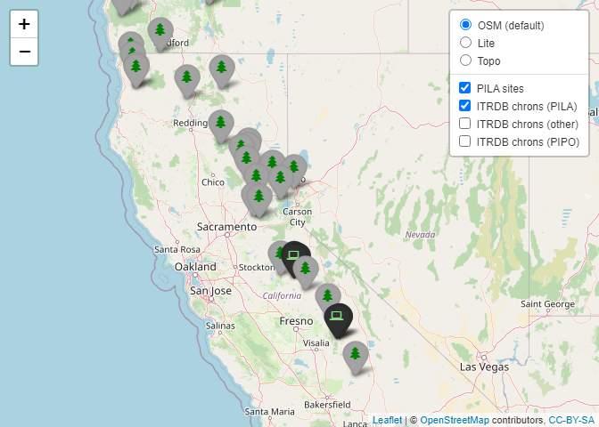

ITRDB references for PILA dating
================
D Perret
2023-11-09

## Sample site map with ITRDB chronologies

``` r
itrdb <- FedData::get_itrdb(species=c("PSME","PILA","TSME","ABCO","ABAM",
                                      "ABMA","CADE","PIPO","PSMA"),label = "thispackagesucks3")

spat.itrdb <- itrdb$metadata %>% 
  filter(MEASUREMENT_TYPE == "Ring Width",
         CHRONOLOGY_TYPE == "Standard",
         END > 1980,
         START < 1900) %>% 
  sf::as_Spatial()
spat.itrdb$x <- spat.itrdb@coords[,1]
spat.itrdb$y <- spat.itrdb@coords[,2]

done.sites <- read.csv("/Users/DanielPerret/Box/01. daniel.perret Workspace/PROJECTS/sugarpine-status-trends/data/FIELD_DATA/S123_092823_CSV/site_data_092823.csv", header=T) %>% 
  select(SITEID = Site.ID,
         ZONE = Niche.zone,
         STATE = State,
         LON = x,
         LAT = y,
         FOREST = National.Forest,
         Site.Locality, Tree.Number, Name, Date)

spat.sites <- done.sites %>% 
  SpatialPointsDataFrame(coords = .[,c("LON","LAT")],
                         data=.,
                         proj4string = CRS(old.proj))

siteicon <- awesomeIcons(icon = "tree",
                      iconColor = "green",
                      library = "fa",
                      markerColor = "lightgray",
                      squareMarker = F)

itrdbicon0 <- awesomeIcons(icon = "laptop",
                      iconColor = "lightgreen",
                      library = "fa",
                      markerColor = "black",
                      squareMarker = F)

itrdbicon <- awesomeIcons(icon = "laptop",
                      iconColor = "yellow",
                      library = "fa",
                      markerColor = "black",
                      squareMarker = F)

itrdbicon2 <- awesomeIcons(icon = "laptop",
                      iconColor = "orange",
                      library = "fa",
                      markerColor = "black",
                      squareMarker = F)

map <- leaflet() %>% 
  # basemap groups
  addTiles(group = "OSM (default)") %>% 
  addProviderTiles(providers$Stamen.TonerLite, group = "Lite") %>% 
  addProviderTiles(providers$Esri.WorldTopoMap, group = "Topo") %>% 
  addAwesomeMarkers(data = spat.sites,
                    lng = ~LON, 
                    lat=~LAT, 
                    group = "PILA sites", 
                    popup= ~paste("SITE ID: ", SITEID),
                    icon = siteicon) %>% 
  addAwesomeMarkers(data = spat.itrdb %>% 
                      as.data.frame() %>% 
                      filter(SPECIES == "PILA"),
                    lng = ~x, 
                    lat=~y, 
                    group = "ITRDB chrons (PILA)", 
                    popup= ~paste("ITRDB: ", SERIES,
                                  "<br>Species: ", SPECIES,
                                  "<br>Start: ", START,
                                  "<br>End: ", END),
                    icon = itrdbicon0) %>% 
  addAwesomeMarkers(data = spat.itrdb %>% 
                      as.data.frame() %>% 
                      filter(!SPECIES %in% c("PIPO","PILA")),
                    lng = ~x, 
                    lat=~y, 
                    group = "ITRDB chrons (other)", 
                    popup= ~paste("ITRDB: ", SERIES,
                                  "<br>Species: ", SPECIES,
                                  "<br>Start: ", START,
                                  "<br>End: ", END),
                    icon = itrdbicon) %>% 
  addAwesomeMarkers(data = spat.itrdb %>% 
                      as.data.frame() %>% 
                      filter(SPECIES == "PIPO"),
                    lng = ~x, 
                    lat=~y, 
                    group = "ITRDB chrons (PIPO)", 
                    popup= ~paste("ITRDB: ", SERIES,
                                  "<br>Species: ", SPECIES,
                                  "<br>Start: ", START,
                                  "<br>End: ", END),
                    icon = itrdbicon2) %>% 
  addMouseCoordinates() %>% 
  setView(lng = -119.7,
          lat = 39,
          zoom = 6) %>% 
  addLayersControl(
    overlayGroups = c("PILA sites","ITRDB chrons (PILA)", "ITRDB chrons (other)", "ITRDB chrons (PIPO)"),
    baseGroups = c("OSM (default)", "Lite", "Topo"),
    options = layersControlOptions(collapsed = FALSE)
  ) %>% 
  hideGroup(c("ITRDB chrons (PIPO)","ITRDB chrons (other)"))


# saveWidget(widget = map,
#            file = "PILAsites_itrdbchrons.html",
#            selfcontained = TRUE)

map
```

<!-- -->
